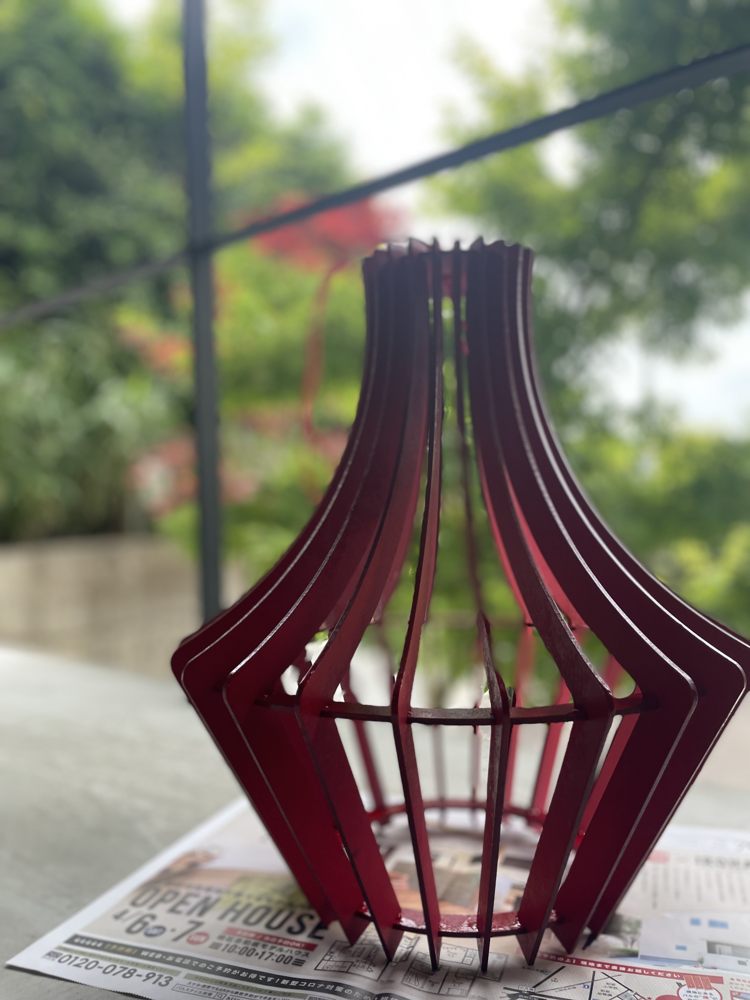
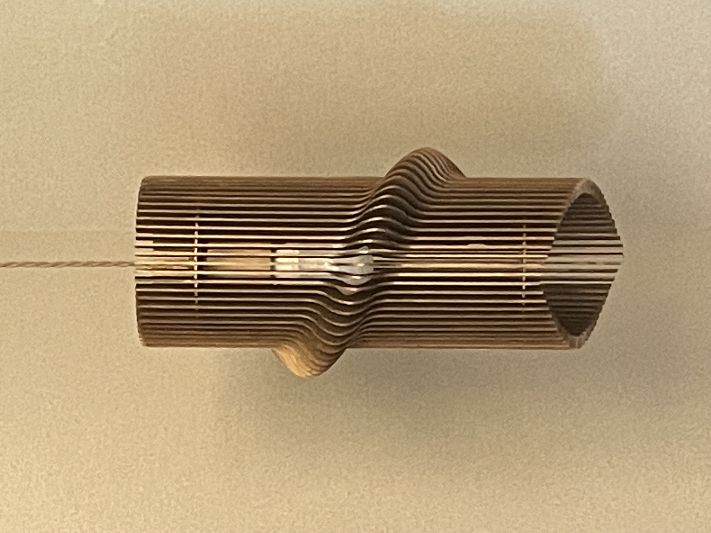
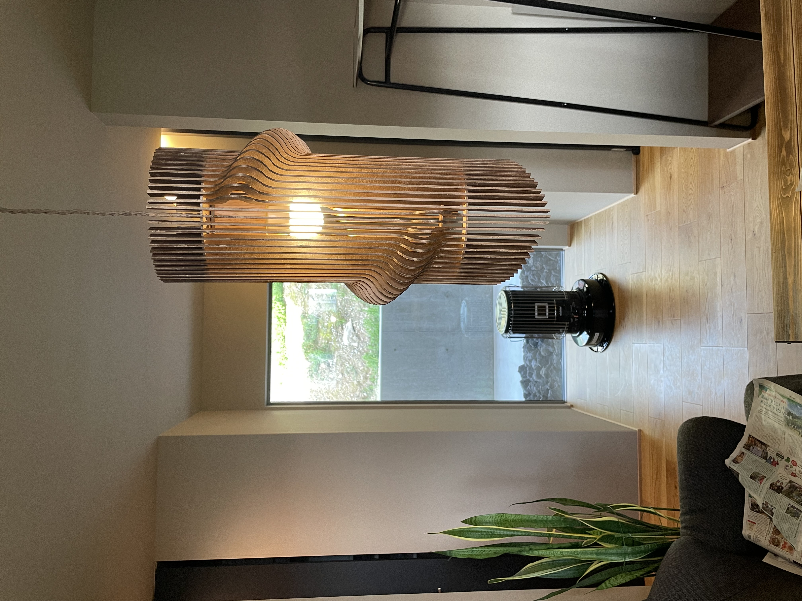
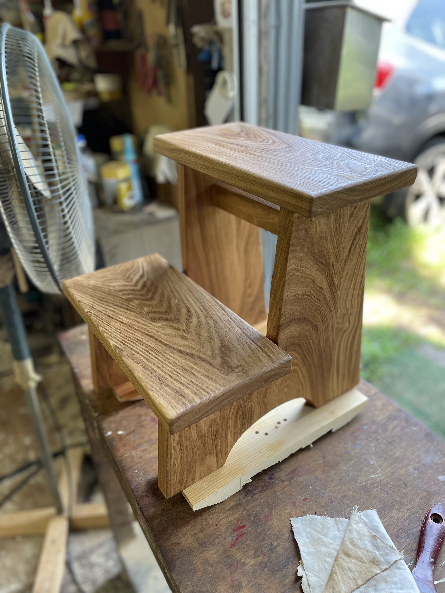
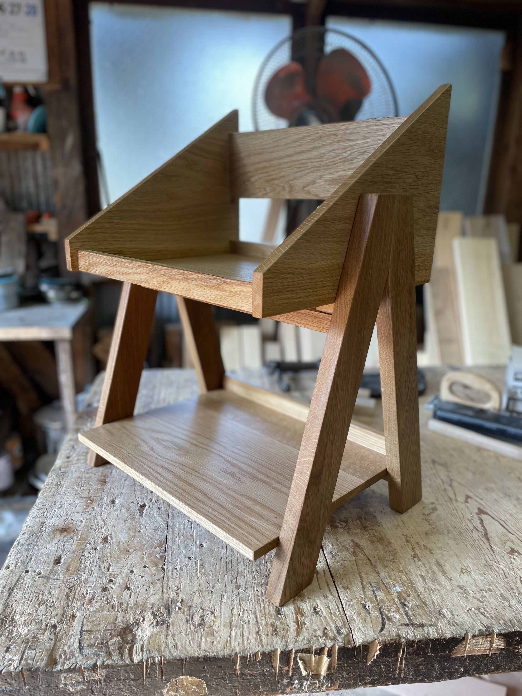
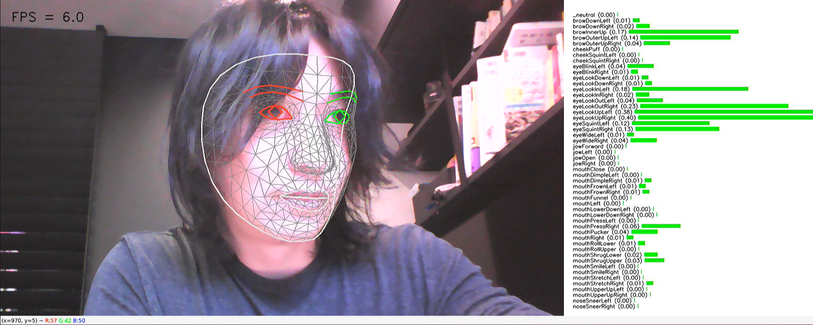
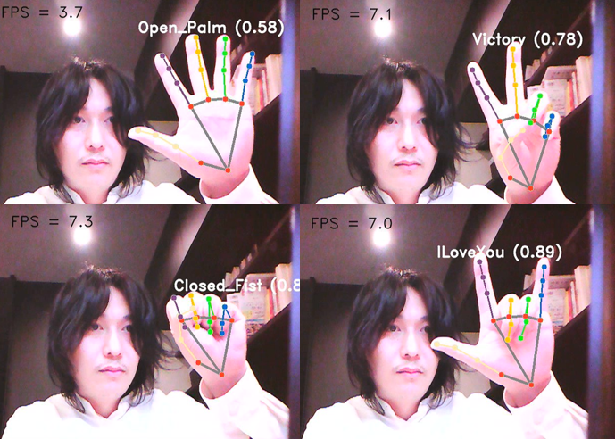
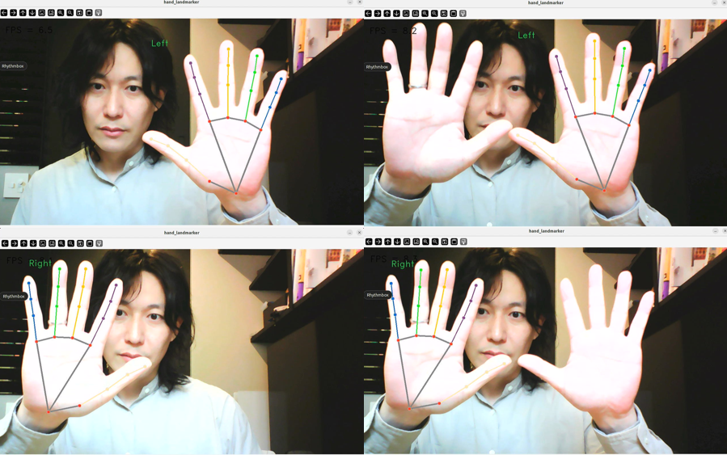
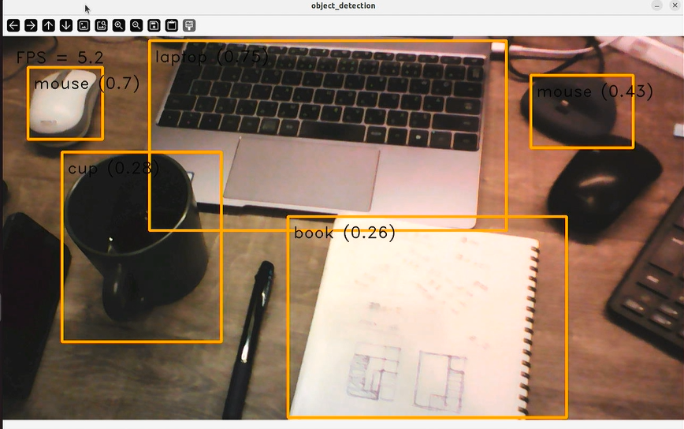
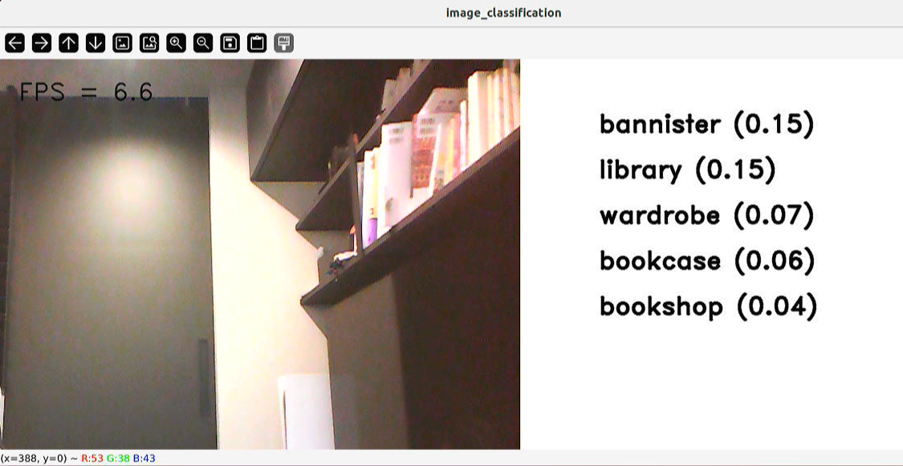

# gesture-lighting
Control of lighting fixtures by hand signs detected by mediapipe

## Overview
I am a software developer working on lighting control and furniture creation using AI technology. This document explains my techniques and creations.

## Hand Sign Detection and Lighting Control using AI Technology
I use an AI model to detect hand signs and control lighting. The following images show the hand sign detection process.

## Hand Gesture Recognition

This technology allows users to easily control lighting using hand signs.

## Introduction to Creations

### Lighting Fixtures
Here are some examples of the lighting fixtures I have created. The designs are output from 3D models and cut from plywood using a laser cutter, with copper and lacquer-like textures.
 

<!-- 

 -->

### Wooden Furniture
To learn woodworking techniques, I created these pieces under the guidance of a furniture craftsman.
 

<!-- 
 -->

## AI Model Demo
Below are demo images of face landmark detection and gesture recognition using the AI models I developed.

### Face Landmark Detection

### Gesture Recognition

### Hand Landmark Detection

## Object Detection and Image Classification
It is also possible to perform object detection and image classification using AI models.

### Object Detection

### Image Classification

## Conclusion
With these technologies and creations, I am able to offer new products and services.

